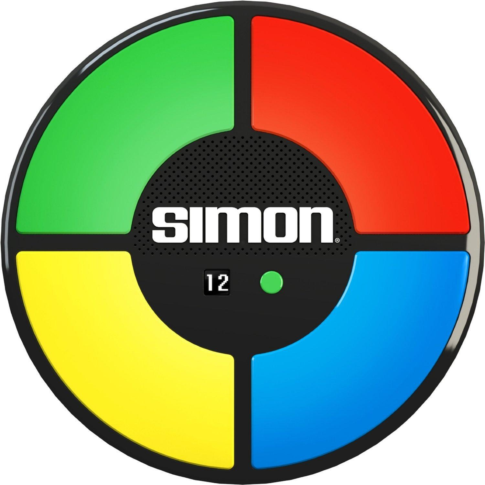
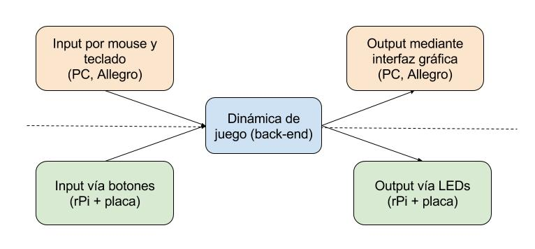
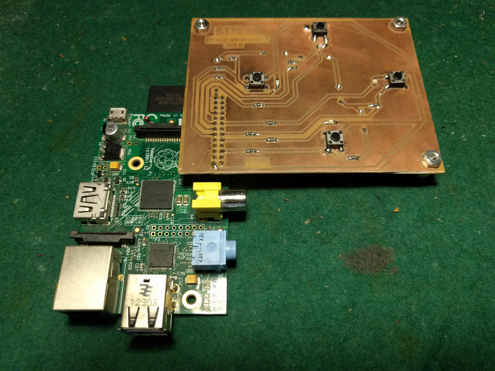
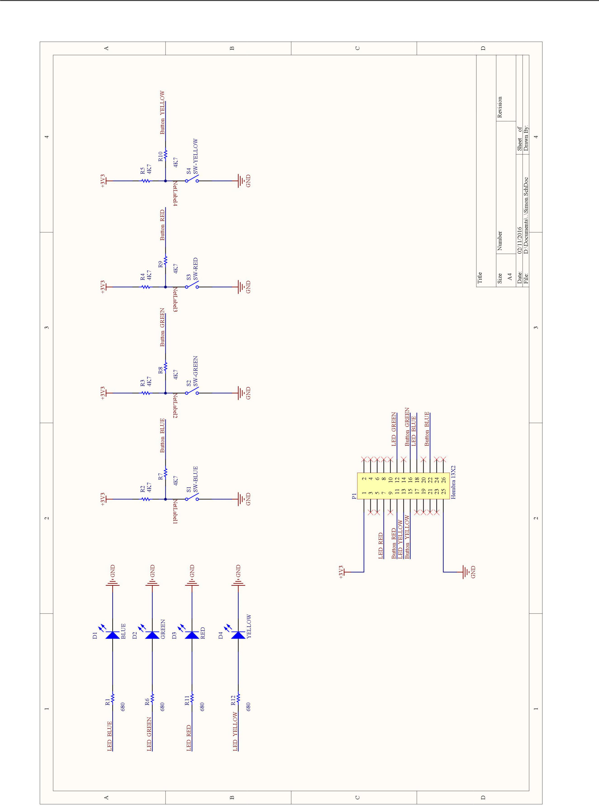
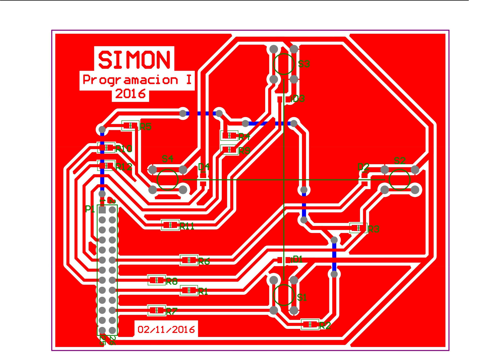

Trabajo Práctico Final 22.07 Programación I 2016B

 **Trabajo Práctico Final**

1.  Requerimientos generales

Se deberá diseñar e implementar el juego Simon, para que pueda visualizarse de manera gráca en una computadora, captando el teclado y el mouse, y en una RaspberryPi con el set de botones y LEDs provisto por la cátedra. Para cambiar entre una versión y otra, se deberá utilizar un switch de compilación.

> Figura 1: Simon

> Figura 2: Arquitectura del programa

1.1  Puntos principales de evaluación

Correcta modularización, uso de herramientas vistas en clase, separación entre front y back-end, validación de todos los datos del usuario, interfaz gráca, uso de mouse y teclado, originalidad.

2.  Dinámica

El juego Simon consiste de cuatro botones, con cuatro luces asociadas
a los mismos. Se prenden en una secuencia que el usuario luego debe
repetir presionando los botones. Esta secuencia incorpora un paso más
a cada vez, de manera aleatoria, aumentando la velocidad. El juego
analiza en cuanto el usuario comete un error y no repite de manera
exacta la secuencia. El puntaje obtenido es igual a la cantidad de
pasos que se repitieron con éxito.
Se deben almacenar en un archivo el puntaje máximo, para que sea
persistente entre distintas corridas del programa.

    2.1  Ejemplo

<!-- -->

a.  Se enciende el botón verde,

b.  el usuario presiona la tecla verde.

c.  Se encienden las teclas verde y azul,

d.  el usuario presiona la tecla verde y azul.

e.  Se encienden las teclas verde, azul, azul,

f.  el usuario presiona la tecla verde, azul, amarilla, cometiendo un error y nalizando el juego con un puntaje igual a 2.

> Pueden a su vez jugar online en el siguiente
> [link.](http://www.freesimon.org/)

3.  Librerías adicionales

Para el desarrollo de la interfaz gráca recomendamos la utilización de
la librería Allegro y sus extensiones.

A su vez, la cátedra proveerá una librería para poder emitir sonido en
la RasberryPi, cuyo uso se recomienda.

4.  Hardware adicional

Para el desarrollo de la interfaz de hardware, la cátedra proveerá
tanto la RaspberryPi como la placa asociada con LEDs y botones, así
como los complementos adicionales necesarios para su utilización. En
el Apéndice de este documento se encuentra toda la documentación
necesaria para poder utilizarlo.

> Figura 3: RaspberryPi junto con placa de LEDs y botones

5.  Entrega

La entrega será tanto escrita como oral y deberán estar presentes
todos los integrantes del grupo. En la exposición se deberá defender
el funcionamiento del programa, su estructura, sus distintos módulos y
los algoritmos utilizados.

Su aprobación es condición necesaria para estar habilitado para rendir
el examen nal escrito. La entrega será en fecha a denir con la
cátedra, como máximo 3 días antes del examen final.

